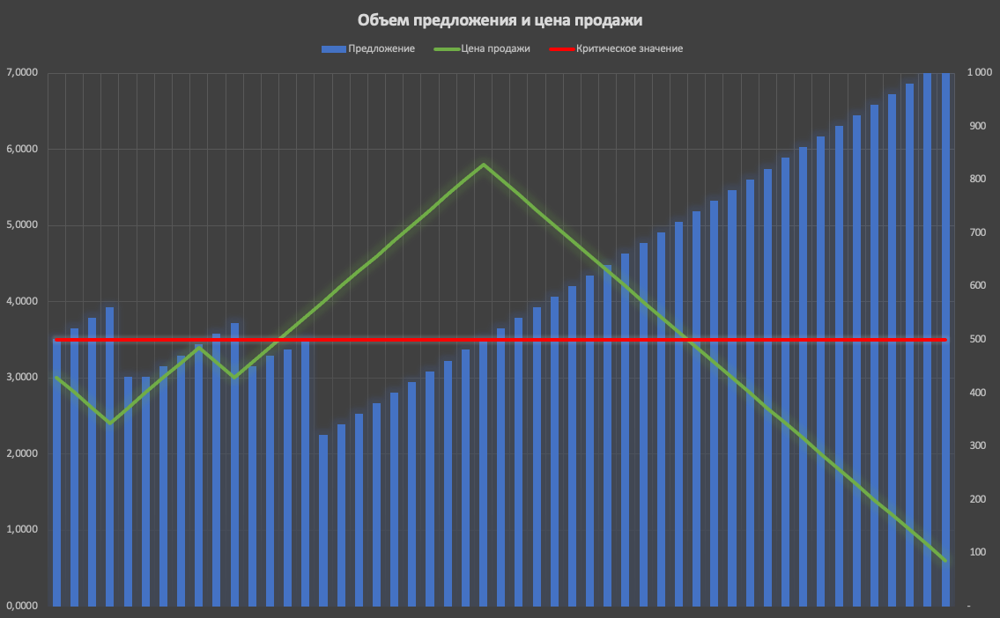

## Часто задаваемые вопросы

### Правила проведения чемпионата
1. #### Сколько участников будет в финале?
   В финал пройдут топ-50 участников по итогам лидерборда Основного раунда.
1. #### Когда закроется возможность загрузки и выбора решений в Основном раунде?
   20 августа в 23:59 МСК. 
1. #### Когда окончательно определится список финалистов?
   В течение 21 августа рейтинговые игры в Основном руанде будут продолжать создаваться в автоматическом режиме. За это время изменчивость рейтинга достигнет достаточного значения, чтобы считать рейтинг стабилизированным. Генерация новых игр остановится **22 августа в 00:00 МСК**, и после расчета всех запущенных игр будут подведены итоги Основного раунда.
1. #### Как будет считаться рейтинг в финале?
   Финальный раунд проводится по системе "Каждый с каждым". Это значит, что среди всех участников финала в рамках одной "волны" будут формироваться все комбинаторно возможные пары в общем количестве `50 * (50 - 1) / 2 = 1225` (то есть "полный круг"). Для обеспечения максимально равных возможностей все игры одной волны будут запускаться с одним и тем же SEED-ом (стартовым "зерном" генератора случайных чисел). Система расчета рейтинга в играх финала заключается в суммировании целочисленных баллов, набранных решением во всех сыгранных играх. Рейтинговый балл за каждую игру начисляется следующим образом:
     - 2 балла за победу
     - 1 балл за ничью
     - 0 за поражение
1. #### По каким игровым правилам проходит финал?
   Кофигурация финала:
   ```toml
    max_time = 100000
    map_size = 1000
    islands = 25
    ships_per_player = 10
    ship_speed = { min = 1, max = 10 }
    ship_capacity = { min = 50, max = 2000 }
    price_change_speed = 0.0001
    price_modifier = { min = 0.25, max = 4 }
    item_consumers = { min = 1, max = 14 }
    item_producers = { min = 1, max = 14 }
    item_base_price = { min = 1, max = 10 }
    item_contractor_max_quantity = { min = 500, max = 1000 }
    item_use_generate_speed = { min = 1, max = 2 }
    items = ["Ткань", "Одежда", "Алмазы", "Камень", "Древесина"]
    user_time_multiplier = 1000
    transfer_time_per_unit = 1
   ```
   Кроме того, с конфигурациями всех раундов можно ознакомиться по ссылкам:
   * [R1-options.toml](R1-options.toml) - Раунд бета-тестирования
   * [R2-options.toml](R1-options.toml) - Основной раунд
   * [R3-options.toml](R1-options.toml) - Финал
1. #### До какого времени будет доступна загрузка решений в финале?
    до 23:59 21 августа
   
1. #### Я смогу сам выбрать своё решения для финала, или организаторы возьмут мое решение из Основного раунда?
    Решение можно будет загрузить и выбрать самостоятельно в течение **21 августа**. Кроме того, в этот период можно будет его протестировать в пользовательских играх на правилах финала.
### Платформа
1. #### Какие установлены лимиты по загрузке решений и количеству битв?
    Лимит количества загрузок решений составляет `48` в сутки (счетчик попыток сбрасывается ежедневно в 00:00 МСК)
  Лимиты на количествово пользовательских битв:
   - в минуту 10 
   - в час 250 
   - в день 1000
   - не более 5 одновременно запущенных
1. #### С какой периодичностью запускаются рейтинговые игры в Основном раунде?
   Минимальный интервал составляет 10 минут. Интервал может вырасти:
   - у всех - при высокой нагрузке на вычислительные мощности
   - у отдельных участников - если решение участника давно не обновлялось, что привело к стабилизации его рейтинга
1. #### С какой периодичностью будут запускаться игры в Финале?
    Игры будут формироваться "волнами" по 1225 штук (у каждого участника будет ровно 49 игр в одной волне). Прогнозируемый интервал полного расчета волны - 2 часа. Все игры одной волны создаются одновременно, а затем рассчитываются в порядке очереди по мере высвобождения вычислительных ресурсов.

### Рейтинговая система Основного раунда
1. #### Что влияет на изменение рейтинга?
   Результаты битв и рейтинг соперников. А именно: 
   - На рост рейтинга влияют победы в битвах. Чем выше текущий рейтинг у побежденных соперников - тем сильнее вырастет рейтинг. 
   - То же самое касается проигрышей - чем слабее обыгравшие соперники, тем сильнее упадет рейтинг. 
     
    Внутриигровые баллы (итоговая сумма "денег" в битве) на рейтинг не влияют.
1. #### Почему мой рейтинг сбросился?
   Рейтинг сбрасывается при смене активного решения (например после загрузки и выбора новой версии).
1. #### Сколько времени нужно на полное восстановление рейтинга после загрузки / перевыбора решения?
   При текущих параметрах проверяющей системы и текущем количестве участников - от нескольких часов до суток.
1. #### Что такое "изменчивость рейтинга"?
   Величина, характеризующая отклонение прогнозируемого значения рейтинга от фактического. Сразу после загрузки / перевыбора решения изменчивость становится максимальной, что позволяет участнику быстро продвигаться вверх по таблице результатов (при условии постоянных побед). Со временем процент побед будет снижаться и изменчивость рейтинга - вместе с ним. 
1. #### Как выбираются соперники для очередной битвы, почему у меня повторяются битвы с одними и теми же соперниками?
   По силе решения (а точнее - по прогнозируемому значению рейтинга). Чем ниже значение изменчивости (то есть, чем ближе прогнозируемое значение рейтинга к фактическому) - тем более стабильным считается рейтинг участника, что приводит к меньшему разнообразию подбираемых соперников.


### Игра
1. #### Почему не приходит событие `offer_rejected`, при повторном предложении одному контрагенту?
    С одним контрагентом одному игроку нельзя иметь больше одного незакрытого контракта в один момент времени.
    При этом `offer_rejected` - это признак того, что предложение не принято по **независящим от игрока причинам** (игрок сделал всё корректно, но, например, конкурент его опередил). А если игорок делает что-то **заведомо некорректное**  - действие просто игнорируется (то же верно и для любых других действий).
2. #### Как меняются цены у контрагентов, на что влияют константы  `item_base_price`, `price_modifier` и `item_contractor_max_quantity`?
    Рассмотрим пример: 
    * У продавца случайно выпало максимально возможное значение предложения: `item_contractor_max_quantity = 1000`
    * Пока его текущее значение предложения `< 500`, цена будет расти (не превышая `item_base_price * 4`)
    * Когда текущее значение стало `> 500`, цена будет падать (не снижаясь ниже `item_base_price * 0.25`)
    * Если никто у него ничего не покупает, то предложение упрётся в `1000`, а цена - в `item_base_price * 0.25`
    * Если постоянно скупают весь товар "под ноль", то предложение будет колебаться около нуля за счет естественного прироста товара, а цена поднимется до `item_base_price * 4`
   
   Пример проиллюстрирован на графике ниже:
   
3. ####  Если на острове два покупателя одного товара и с обоими заключен контракт. В какой последовательности будут закрываться контракты при выгрузке нужного товара на остров?
    C меньшим `id` выполняется первым.
4. #### В каком случае приходят события `contract_started` и `contract_completed`, а в каком - не приходят?
    Для покупок (игрок покупает у контрагента) приходит только `contract_started` с `NULL` в поле `contract`
`contract_completed` для покупок не приходит. 
   Для продаж (игрок продает контрагенту) - приходят оба события.
   
5. #### А есть полный список причин по которым предложение сделки может быть отклонено? 
    Единственная причина - вы пытаетесь договориться на большее количество чем текущий спрос/предложение.

6. #### Что будет, если я заключу контракт на продажу, но не поставлю товар? По идее заключение такого контракта бесплатно и заключить один контракт может только 1 игрок.
    Другие игроки могут заключать контракты с тем же с кем вы заключили, единственное им вероятно придется подождать пока спрос/предложение снова появится.
7. #### Можно подробнее объяснить эту фразу из описания поля `"contract" INTEGER` события `contract_started`: "Контракт, который был начат. Может отсутствовать, если контракт также мгновенно завершился - при покупке."?
    Когда игрок покупает товар, сразу списывается предоплата, и контракт считается выполненным, даже если товары игрок еще не забрал. То есть этот контракт не успеет попасть в таблицу `world.contracts`, и у него не возникнет `id`. Поэтому при мгновенном завершении в событии вернется `NULL`. 

### ...